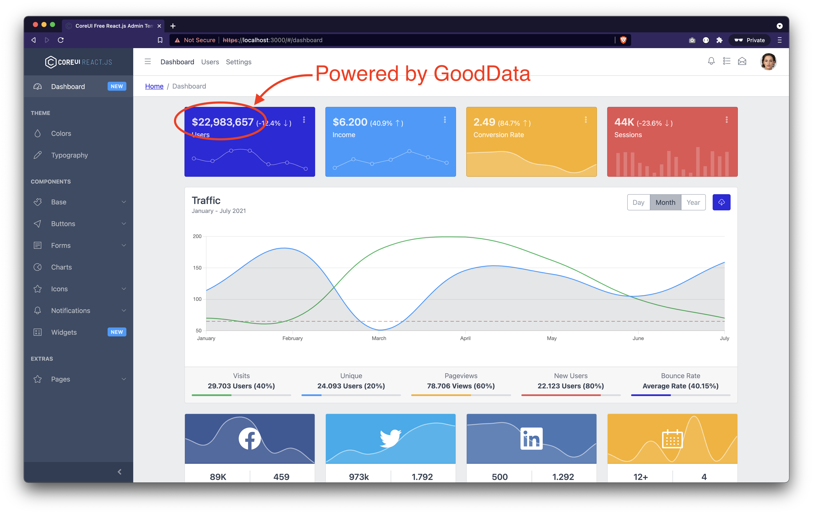

# CoreUI React w/ GoodData.UI

This project demonstrates how to connect [CoreUI Free React Admin Template](https://coreui.io/react/) (version 4.0.0) to GoodData Analytics Platform using [GoodData.UI SDK](https://sdk.gooddata.com/gooddata-ui/) (version 8.6.0).

## Live demo

This app is deployed at https://gooddata-demo.s3.amazonaws.com/gooddataui-coreui-example/index.html.

## How to run locally

* `git clone git@github.com:gooddata/gooddataui-coreui-example.git`
* `cd gooddataui-coreui-example`
* `yarn install` (or `npm install`)
* `yarn start`

## How to build for deployment

* `yarn build` when deploying to root folder
* `PUBLIC_URL=/gooddataui-coreui-example yarn build` when deploying to `/gooddataui-coreui-example` folder

## Backend/proxy info

This app is configured to run against https://interactive-examples-proxy.herokuapp.com/. No authentication required.

## Screnshot

