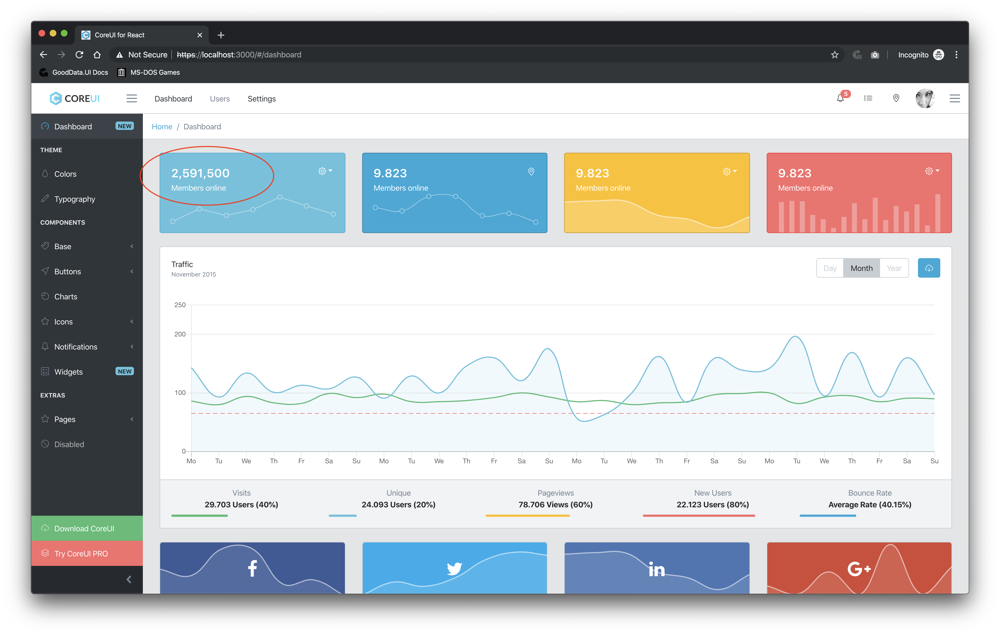

# CoreUI React w/ GoodData.UI

This branch is part of the [CoreUI React w/ GoodData.UI](https://github.com/gooddata/gooddataui-coreui-example) series that demonstrates how to connect [CoreUI Free React Admin Template](https://coreui.io/react/) to GoodData Analytics Platform using [GoodData.UI SDK](https://sdk.gooddata.com/gooddata-ui/).

## How to run locally

* `git clone --branch article git@github.com:gooddata/gooddataui-coreui-example.git`
* `cd gooddataui-coreui-example`
* `yarn install` (or `npm install`)
* `yarn start`

## How to build for deployment

* `yarn build` when deploying to root folder
* `PUBLIC_URL=/gooddataui-coreui-react yarn build` when deploying to `/gooddataui-coreui-react` folder

## Backend/proxy info

This app is configured to run against https://developer.na.gooddata.com/. For access, you can register at https://gooddata-examples.herokuapp.com/.

## Screnshot

